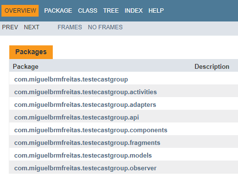

# TesteCastGroup
Repositório para a avaliação técnica do processo seletivo da Cast Group que envolve um app Android e um backend com conexão com Banco de Dados.

# Especificações técnicas

Implementação de uma API para rotas do backend e de conexão com o banco de dados e de um app Android que se conecte com essa API, apresente dados na tela e receba input dos usuários. Mais detalhes sobre o que foi feito no app e na API nas subseções abaixo.

## Diagrama de Casos de Uso


## Android

Aplicação Android nativa em Java para se conectar com a API descrita abaixo e mostrar uma lista de cursos de formação da Cast Group na tela e receber inputs do usuário para operações de adicionar, editar, remover e filtrar cursos. 

A aplicação segue boas práticas de desenvolvimento orientado a objetos, engenharia de software, tratamento de erros, usabilidade e UX.

### TODO List
- [X] Criar estrutura de classes 
- [X] Gerar documentação JavaDoc
- [ ] Conectar com a API feita para este projeto
- [ ] Mostrar lista de cursos na tela
- [ ] Ação de cadastrar curso com descrição, categoria, número de alunos e datas de início e fim
- [ ] Ação de editar curso
- [ ] Ação de remover curso
- [ ] Filtrar cursos por categoria
- [ ] Usar Material Design para os componentes
- [ ] Mostrar alerta de erro para o usuário em caso de ação proibida pelo servidor
- [X] Aplicação de um ou mais padrões de projeto
- [ ] Mais funcionalidades a incluir e descrever

### Documentação
O app foi documentado usando o padrão **JavaDoc** e a página de documentação com detalhes sobre as classes e seus respectivos métodos pode ser encontrada em **TesteCastGroup/documentation/index.html**. Para gerar a documentação pelo próprio Android Studio, vá em **Tools -> Generate JavaDoc**. A raiz mostra os pacotes criados na estrutura de classes e fica assim:



Então entrando em um pacote e depois em uma respectiva classe ou interface, tem-se os detalhes:


## Padrões de Projeto
Foi escolhido o padrão de projeto Observer para lidar com as chamadas à API feitas pelo app. Foi implementada uma classe **Subject** e outra **Observer** em que os observers (activities e fragments) se registram a um subject (chamadas de API), chamando callbacks nos observers quando são notificados pelo subject. Mais detalhes das classes podem ser conferidas na documentação.

### Como rodar

Abra a pasta **TesteCastGroup** da raiz pelo Android Studio como um projeto. Uma vez carregado, ir em **Build -> Make Project** e depois no ícone de **Run**, escolhendo o dispositivo virtual ou físico em que o app será executado.  

Para facilitar os testes dispensando configurações adicionais para o rodar o servidor e o banco de dados manualmente, foi feito o deploy da aplicação de backend para o Heroku. Portanto, ao abrir o aplicativo Android ele já estará integrado com uma versão em produção do servidor implementado aqui e acessando o mesmo banco de dados, podendo ver os exemplos que estarão disponibilizados. Mais detalhes na subseção de **deploy** abaixo na descrição do servidor.

## Servidor

Aplicação em node.js + Express que implementa um CRUD para realizar operações de pesquisa, inclusão, alteração e exclusão de cursos para turmas de formação da Cast Group.

Foi implementada função de cadastro de categoria (POST) para criar os registros prévios requisitados para o projeto. Cada categoria possui código e descrição

Cada curso possui obrigatoriamente descrição, data de início, data de final e categoria (que tem um model próprio com código e descrição). Opcionalmente pode ser colocado número de alunos.


### TODO List
- [X] Rota GET /categories - Lista categorias existentes
- [X] Rota POST /categories - Cadastrar categoria
- [X] Rota POST /courses - Cadastrar um novo curso
- [X] Rota GET /courses - Listar todos os cursos cadastrados
- [X] Rota GET /courses + query param category - Pesquisar por cursos de determinada categoria
- [X] Rota PUT /courses/:id - Editar curso existente
- [X] Rota DELETE /courses/:id - Deletar curso
- [X] Validar se a data de início de um curso não é maior que a data de final
- [X] Validar e não permitir que um curso seja incluído no mesmo período que outro 

### Como usar

#### Instalando dependências

```bash
npm install
```

#### Banco de Dados

Foi escolhido o MongoDB como banco de dados. É um banco de dados orientado a documentos e foi criada uma model <b>Course</b> para representar um curso com todos os atributos anteriormente citados e uma model <b>Category</b> para representar uma categoria. Dentro da model <b>Course</b> existe uma referência para uma model de <b>Category</b>.

Como configuração prévia do banco de dados, foram cadastradas 4 categorias utilizando o próprio método POST implementado. Cada Categoria possui campos *code* e *description*, além de um identificador único criado pelo Mongo.


Edite o arquivo /config/default.json para incluir a URL correta do seu banco se for testar localmente com seus próprios dados.

#### Rodar servidor em modo de desenvolvimento

```bash
npm run server  # Express API: 5001
```

#### Deploy
Foi feito o deploy da aplicação node.js para o Heroku na URL: https://teste-cast-group.herokuapp.com/.

É possível assim utilizar a API por esta URL para testar as rotas como uma alternativa a rodar o servidor localmente.

